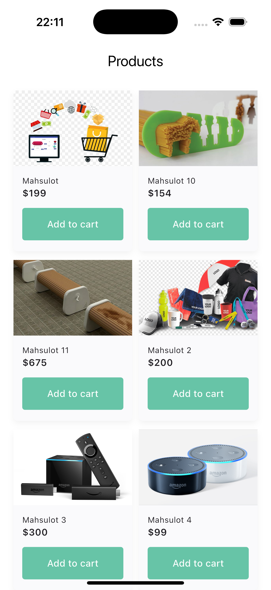
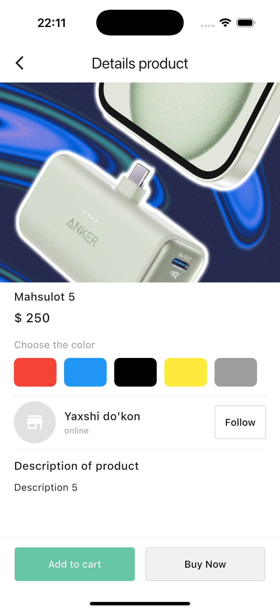

# 🛍 Uzum E-Commerce App

A Flutter-based **E-Commerce App** built with **GetX**, **MVVM Architecture**, and **Firebase** backend.  
This project includes product listing with **pagination**, detailed product views, and modern UI components.

---

## 🚀 Features

- 🧠 **State Management**: GetX
- 📦 **Architecture**: MVVM (Model-View-ViewModel)
- 🔥 **Backend**: Firebase Firestore
- 📱 **Pagination**: Infinite scroll (load 10 products per page)
- 🖼 Product details, image, description, and color selection
- 🛒 "Add to cart" & "Buy Now" buttons
- 🌐 Clean and responsive UI

---

## 🧩 Tech Stack

| Tool      | Usage               |
|-----------|---------------------|
| Flutter   | UI Framework        |
| GetX      | State Management    |
| Firebase  | Backend (Firestore) |
| MVVM      | Code Architecture   |

---

## 📸 Screenshots

| Home Screen | Details Screen |
|-------------|----------------|
|  |  |

---

## 📹 Demo Video

[

 
---

## 🔧 Folder Structure (MVVM)

